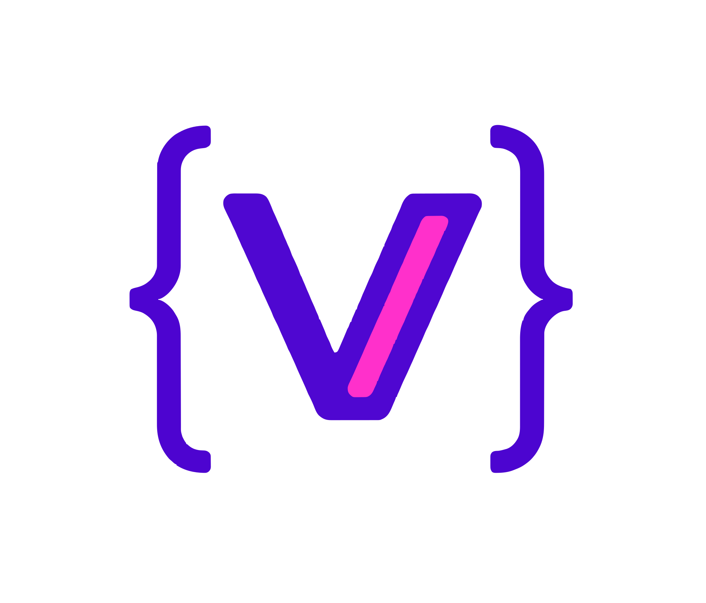

# <div style="height:55px;display:flex"> My VibeCode Editor</div>

A modern, powerful web-based code playground built with **Next.js**, **Monaco Editor**,**Monacopilot**, **MongoDB**,**Gemini AI Auto Code Completion**, **NextAuth**, and **ShadCN UI**, **WebContainer**.  
Live playgrounds, syntax-highlighting, themes, templates, and cloud sync — all in one place.

## 🌐 Live Demo

👉 **https://my-vibe-editor.vercel.app/**

---

## ✨ Features

## 🧠 AI & Editor Features

### 🤖 Gemini-Powered AI Code Completion

This project uses **Google Gemini API** to generate intelligent code predictions:

- Inline AI suggestions (ghost text)
- Predicts next lines in real time
- Accept suggestions with `Tab`
- Works across multiple languages
- Fast streaming completions

### 🎨Monaco Editor Features

- 🚀 Monaco Editor with **custom Dark & Light themes**
- ⚡ Live code execution support
- 💡 Auto-completion (powered by custom AI + Monaco suggestions)
- 🎯 Syntax highlighting for JS, TS, HTML, CSS, JSON
- 🧩 Multi-playground support
- ⭐ Starred & Recent playgrounds sidebar

## 🧩 WebContainer — **Browser-based Code Execution**

Your app includes **WebContainer** (by StackBlitz) allowing:

- Run JavaScript projects **inside the browser**
- No server required
- Real-time preview of output
- Install npm packages in-browser
- Execute Node.js-like environment using WebAssembly
- Perfect for interactive coding/playground experience

### WebContainer Supports:

✔ Live server preview  
✔ File system in browser  
✔ Run code without backend  
✔ Preview HTML / JS instantly

### 👤 Authentication

- 🔐 NextAuth.js integration
- Login with:
  - ✔ Google OAuth
  - ✔ GitHub OAuth
- Secure sessions & user-based playground storage

### 🗂 Dashboard

- ✔ Sidebar with Home, Dashboard, Starred, Recent
- ✔ Custom icons for each playground
- ✔ Settings dropdown with theme toggle

### 🌑 Theme System

- Dark & Light themes
- Auto-highlight for selected theme
- Fully compatible with ShadCN UI

### ☁ Deployment

- Fully optimized for **Vercel**
- Builds using Turbopack
- SSR + RSC + App Router support

---

## 🛠 Tech Stack

| Technology        | Description                     |
| ----------------- | ------------------------------- |
| **Next.js 15+**   | App Router, RSC, Server Actions |
| **React 19**      | UI and Components               |
| **MongoDB**       | Database                        |
| **Prisma**        | ORM                             |
| **Monaco Editor** | Advanced code editor            |
| **Gemini API**    | AI Code suggestions             |
| **OpenAI SDK**    | AI Code suggestions             |
| **WebContainer**  | In-browser runtime              |
| **NextAuth.js**   | Authentication                  |
| **Tailwind CSS**  | Styling                         |
| **ShadCN UI**     | Components                      |
| **Vercel**        | Deployment                      |
| **TypeScript**    | Type safety                     |

---

## 🚀 Getting Started

### 1️⃣ Clone Repo

```sh
git clone https://github.com/yourusername/your-repo.git
cd your-repo
```

### 2️ Install Dependencies

```sh
npm install
```

### 3️⃣ Configure Environment Variables

```ini
DATABASE_URL="your_mongodb_url"
AUTH_SECRET="your_secret_key"

# Google OAuth
GOOGLE_CLIENT_ID=your_google_client_id
GOOGLE_CLIENT_SECRET=your_google_client_secret

# GitHub OAuth
GITHUB_CLIENT_ID=your_github_client_id
GITHUB_CLIENT_SECRET=your_github_client_secret

# Gemini API Key (for AI code completion)
GEMINI_API_KEY=your_gemini_api_key

```

### Run Locally

```sh
npm run dev
```
